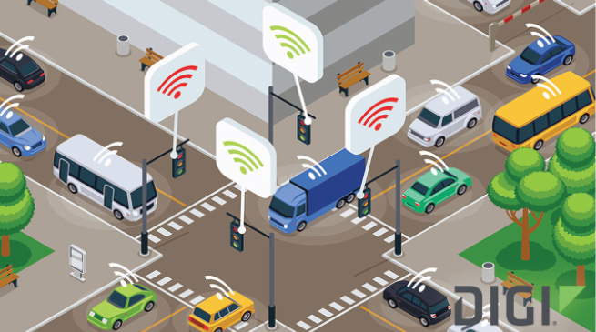

# Gestion des feux de signalisation dans une smart city

## Objectifs
- Modifier des jouets "feux de signalisation" pour en faire un parc de feux connecté (en wifi avec des ESP32)
- Développer un manager de feux de signalisation permettant de :
  - configurer un carrefour (sauvegarde yaml)
  - gérer un carrefour
  - gérer un feu seul
- Développer des interfaces à ce manager :
  - obligatoire : driver ROS
  - obligatoire : interface web (flask)
  - optionnel : Appli mobile avec Flutter/Dart

## Rendu spécifique au projet :
- Manager de feux de signalisation dans un conteneur docker
- Firmware et documentation de câblage des ESP32 / feux de signalisation. 

## Autres infos
Il est recommandé de passer au travers d'un routeur wifi et d'utiliser des requêtes POST. Cependant, l'architecture est à valider dans une discussion avec le prof.  

Le projet nécessite de maquetter une route, en collaboration avec le projet de Véhicule autonome

## Technologies
* ESP32
* Python / Flask
* ROS
* Docker
* Flutter/Dart

## Liens utiles
* 
