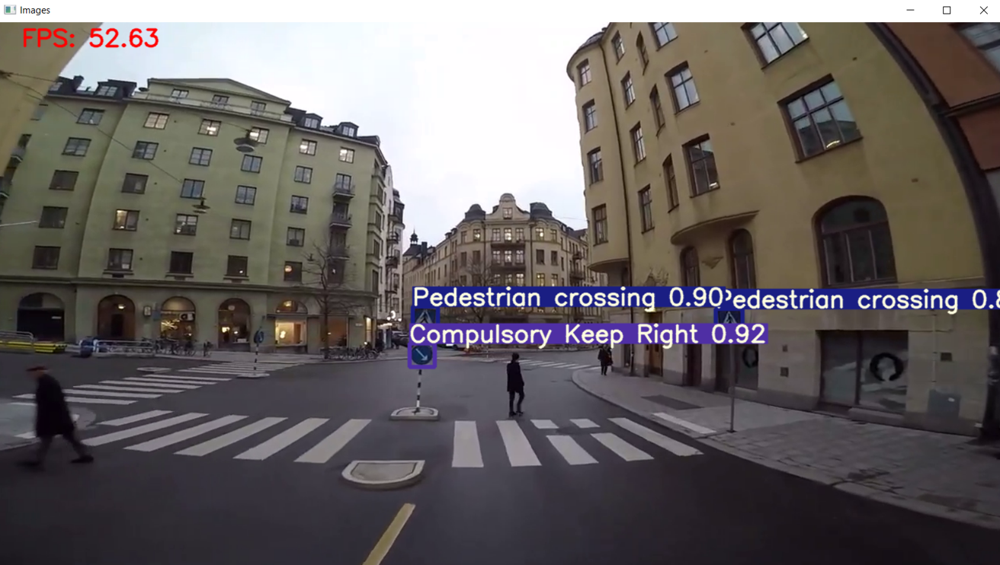

# Navigation de véhicules en milieu urbain

## Objectifs
Faire naviguer des véhicules (Turtlebot + [Limo](https://global.agilex.ai/products/limo)) dans un environnement urbain (route, feu, piétons, signalisation, ...) en respectant sa réglementation (laisser) 

## Rendu spécifique au projet :
- Un conteneur docker contenant :
  - Un réseau de neurone dont les inférences tournent sur GPU:
    - Classe requises :
      - Tous les panneaux fournis (jouets)
      - Tous les personnages fournis (jouets)
      - Signalisation lumineuse (état des  )
  - Un noeud ROS avec :
    - en entrée : un flux vidéo (caméra)
    - un traitement pour définir le déplacement du robot:
      - Réseau de neurone
      - Post-traitement, par exemple l'état du feu (roue, vert, orange)
    - en sortie : à minima une commande en vélocité du robot, mais idéalement un client d'action lié à la couche de navigation du robot 

La solution dockerisée devra pouvoir tourner indépendamment sur un Turtlebot (sur PC Triton, durant le sprint 1), un Limo (sur Jetson Nano, durant le sprint 2)  

Le projet nécessite de maquetter une route, en collaboration avec le projet de Smart City

## Technologies
* ROS
* Python
* darknet/TF
* Docker

## Liens utiles
* 
