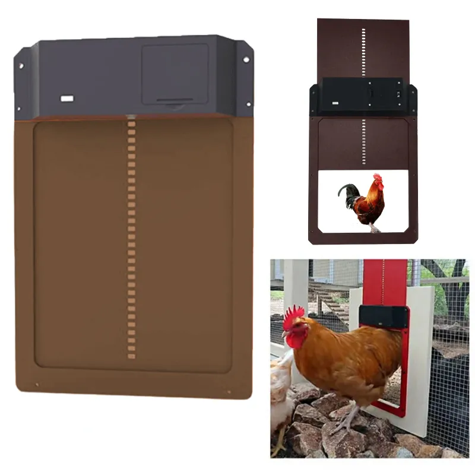

# Poulailler connecté

## Objectifs

Faire un hack d'une [trappe "automatique" low-cost](https://fr.aliexpress.com/item/1005004211155375.html) en un véritable système autonome connecté à la maison. 

## Tâches attendues
- Lier la trappe à une carte [ESP32-C6](https://fr.aliexpress.com/item/1005006050114562.html) avec 
    - une connectivité ZigBee (et wifi en dev mode)
    - gestion des modes de consommation (la plupart du temps en sleep)
    - soit se lier à la carte moteur, soit refaire la partie commande moteur
- Ajouter un capteur de luminosité (pour intensifier les réveils de mesure de présence)
- Ajouter un capteur de présence des poules. Plusieurs options possibles, avec différents niveaux de difficultés :
    - Ajouter un ESP32-CAM avec un réseau de neurone permettant de compter le nombre de poules, voir de les différencier, voir de compter les oeufs.
    - Mettre un capteur [PIR](https://fr.aliexpress.com/item/1005005903120674.html) ou [radar](https://fr.aliexpress.com/item/1005005244405921.html) ou [RFID pour puces animaux](https://fr.aliexpress.com/item/32861558032.html) ou autre...
- Rendre autonome en énergie (solaire + tampon batterie)
- Mettre en veille ou couper l'alimentation des cartes / composants non exploités
- Lier le système à Home Automation (ZigBee)

## Technologies

- ZigBee
- ESP32-C6 avec gestions des modes de consommation
- Energy harvesting
- Un peu d'élec
- tensorflow lite micro, ou autre solution d'IA embarqué. [EXEMPLE](https://www.hackster.io/mjrobot/esp32-cam-tinyml-image-classification-fruits-vs-veggies-4ab970)
- Home automation
