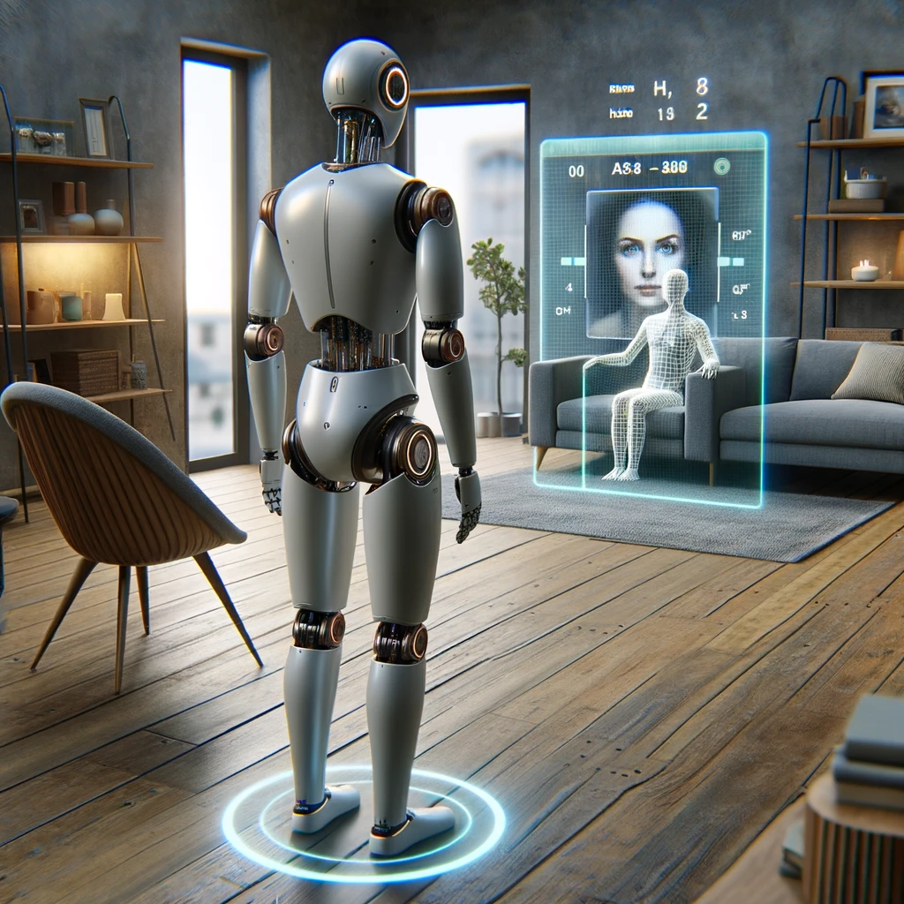

# \[Robocup\] Brique Vision

## Objectifs

Développer une brique ROS2 de vision permettant d'identifier et caractériser à partir de nimporte quelle caméra 3D :
- Les personnes
    - Associer une TF[^1] (x,y,z)
    - Attributs (e.g. genre, âge, lunettes, ...)
    - Posture (e.g. debout, assis, couché)
- Les objets  
    - Associer une TF (x,y,z)
    - Classification dans une taxonomie (e.g. "Aliment -> concombre", "objet -> outil -> perceuse") pour les objets [YCB](https://www.ycbbenchmarks.com/)
  
[^1]: TF : [TranForm](https://docs.ros.org/en/humble/Tutorials/Intermediate/Tf2/Introduction-To-Tf2.html)

## Contraintes
- Un petit état de l'art des technos doit être documenté
- Les fichiers d'algo sont à séparer des fichiers de noeud ROS.
- Il ne faut pas utiliser les APIs spécifiques à des caméras, mais créer une API commune.

## Technologies
- ROS2
- vision
- deeplearning
- python
