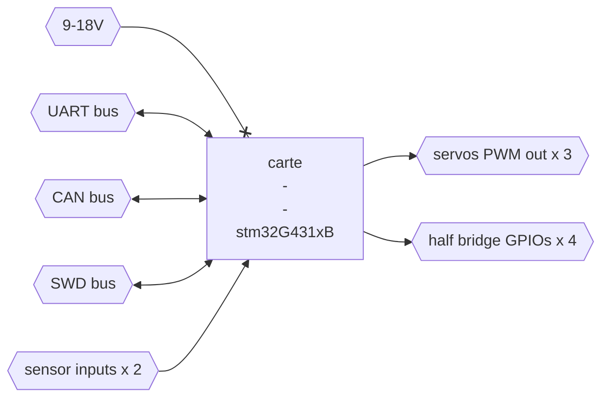

# [Autonomous Crawler Fleet] Electronique de commande

## Objectifs

Créer l'électronique pour la flotte de véhicules autonomones. Il s'agit de créer une carte la plus compacte possible, que l'on puisse instancier à différents endroits de chaque véhicule, afin d'interfacer les différents organes (feux, clignotant, moteur direction, moteur boite de vitesse, moteur deplacement, ...) au travers d'un bus CAN-FD.

## Tâches attendues
- Proto sur carte Nucléo / Bread board (STM32G431xB)
- Design compact / Assemblge / Test du PCB
- Firmware générique
- Boitier en impression 3D
- Developpement du "Hardware Interface" ROS

## Techno
- Design de carte électronique
- Firmware C
- bus CAN-FD
- impression 3D
- ROS (hardware_interface)

