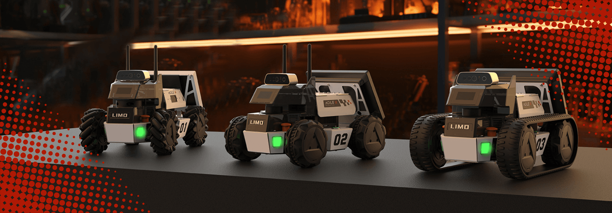
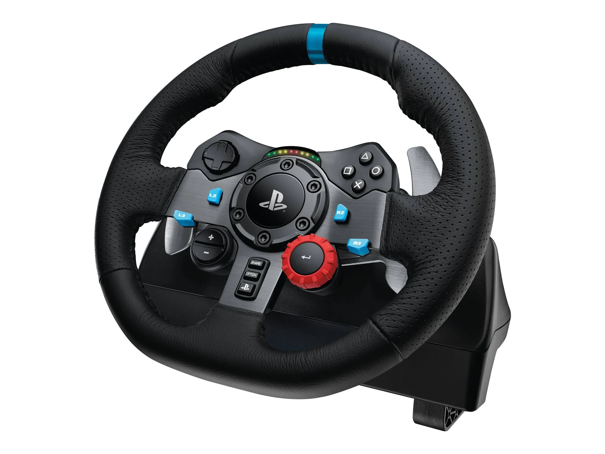

# Sujet 2 - Scénario libre avec le LIMO

  <video class="videoembed" autoplay muted loop playsinline>
    <source src="img/Limo.mp4" type="video/mp4">

    Your browser does not support the video tag.
  </video>

## Objectifs
- Usage d'un robot LIMO pour un scénario robotique à définir. 
- Demo adhoc avec tous les types de roues

## Tâches attendues
- Migrer les LIMO en ROS2 (humble). Repo fourni
- Proposer un scénario intégré à la salle de projet
- Implémenter le scénario proposé avec une démo
- Préparez une démo adhoc avec pilotage volant :
    - en omniwheel
    - en ackermann
    - avec chenilles  

Limo montés avec les 3 types de roues :  

## Contraintes
- Usage embarqué de ROS2 humble
- Navigation autonome
- Feature Navigation manuelle (avec volant / pédales)

## Technologies
- ROS2
- Python / C++
- Lidar / Caméra 3D 
- Jetson

## Ressources

- [Doc du LIMO en ROS2](https://github.com/agilexrobotics/limo_ros2_doc/blob/master/LIMO-ROS2-humble(EN).md)  

- [Repo ROS2 du LIMO](https://github.com/agilexrobotics/limo_ros2)

