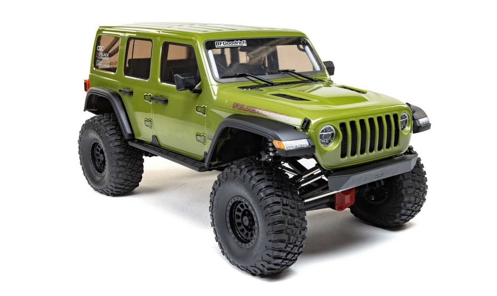

# [Autonomous Crawler Fleet] Localisation et mapping

## Objectifs

Naviguez en vous localisant avec une odométrie (VIO)

## Tâches attendues
1. Intégration minimale
    - Proposez une estimation grossière de l'odométrie et qualifiez-la.
    - Intégrez d'une caméra 3D intel realsense au véhicule. :warning: Sous la supervision de Sébastien Altounian
    - [Améliorez l'odométrie grâce à la realsense (VIO)](https://docs.nav2.org/tutorials/docs/integrating_vio.html)
2. Vers une navigation autonome (à faire si vous êtes 3 ou plus)
    - Utilisez carte électronique + "Hardware Interface" (ros2_control) pour piloter la voiture depuis ROS
    - Associez odométrie et navigation pour naviguer en autonomie dans une carte
    

## Techno
- Odométrie
- Jetson Xavier Orin
- Caméra 3D
- ROS2 (hardware_interface)

