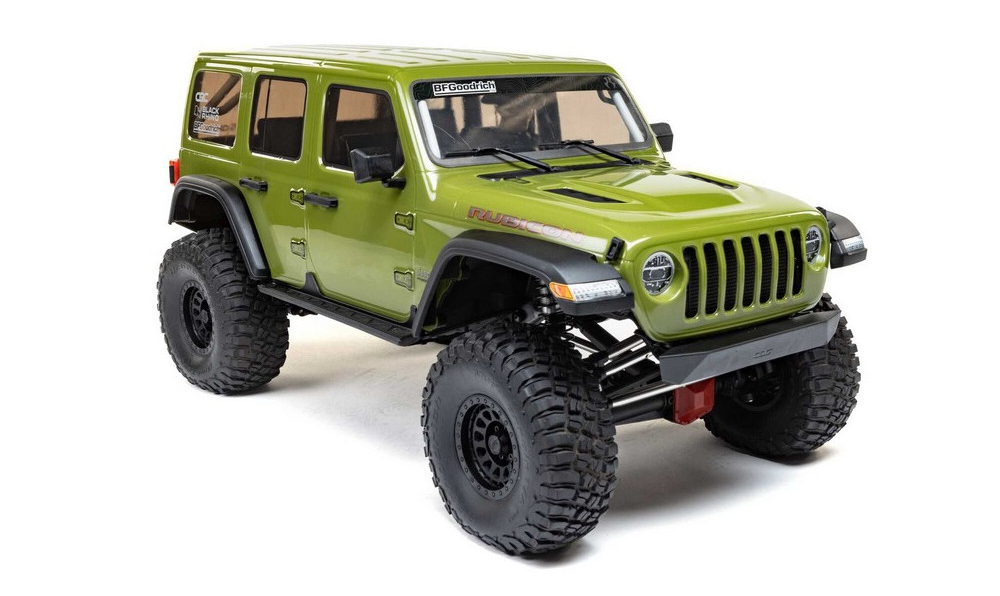

# [Autonomous Crawler Fleet] Brique de vision

## Objectifs

Développez une brique de vision pour le véhicule autonome.

## Tâches attendues
1. [Obligatoire] Etat de l'Art
2. [Obligatoire] Détection et localisation (3D) :
    - les panneaux de la salle robotique
    - les feux de circulation de la salle robotique (et leur état)
    - les piétons de la salle robotique
    - les voitures de la salle robotique
    - [Option] Les différents robots de la salle robotique
3. [Obligatoire] Usage d'un réseau de neurone:
    - Choix d'un réseau existant avec le bon compromi de performance et d'embarquabilité (Jetson Xavier Orin)
    - Fine Tuning pour répondre à certaines exigences ci-dessus
3. [Options] Autres features :
    - Fusion de données avec le radar
    - Suivi de lignes

## Techno
- Caméra 3D
- Vision
- IA
- Jetson Xavier Orin
- ROS2 (hardware_interface)

