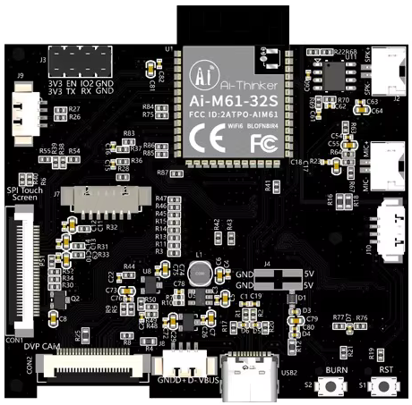

# 🧸 Peluche Audio 

## 🎯 Contexte du Projet

Dans le cadre d'une sollicitation d'une association à but non lucratif, un projet (un peu en marge des projets de la majeure) est proposé en électronique pour des contenus audio. L'idée est de réaliser un PoC (Proof of Concept) d'une peluche audio très bas coût qui puisse avoir deux cibles :

- Les enfants dans les zones du monde sous tension (guerre, situations précaires, etc.) : version gratuite avec des histoires dans leur langue, encourageantes et réconfortantes
- Les enfants occidentaux : version payante pour financer les versions envoyées gratuitement, avec des contenus de livres audio classiques

---

## 🔧 Évolution Technique

Un partenariat pourrait être établi pour commencer avec la peluche mouton de [Kulumi](https://kulumi.org/wp-content/uploads/2023/05/KULUMI-Sheep-brochure.pdf), en remplaçant leur boîtier par un nouveau boîtier qui répond mieux au besoin (leur modèle est cher, et ils ne veulent pas investir dans un nouveau hardware).

Un premier prototype a été conçu avec une puce ESP32-A1S, mais celle-ci est en voie d'obsolescence. L'idée est de partir sur une puce **Ai-M61-32S** ou autre option à proposer.

Il s'agit de refaire le boîtier noir du player audio en étant rétro-compatible avec le mouton (par la suite, d'autres peluches pourront être envisagées). Le mouton doit donc contenir toutes les fonctionnalités et spécifications (puissance, interface utilisateur, autonomie, reprise de la lecture au démarrage, etc.) du mouton initial, tout en embarquant les fonctionnalités suivantes :

- Connectivité pour transférer des contenus audio depuis une application mobile (BLE/WiFi)

---

## 📋 Travail à Réaliser

Le travail consiste donc à :

- Designer et tester une carte électronique répondant au besoin
- Designer un nouveau boîtier (ou designer la carte de sorte à pouvoir reprendre le boîtier actuel)
- Écrire un firmware permettant de "donner vie" à la peluche
- Écrire un PoC d'application mobile permettant de mettre en évidence un transfert de fichier aussi simple que possible depuis n'importe quel smartphone

---

## 📝 Cahier des Charges

### 1. Contraintes Physiques

- Encombrement identique au boîtier actuel, peut être environ 3-4 mm plus épais que le boîtier actuel
- Encombrement total : HP + Batteries + Carte + Boîtier < 18 mm × 63 mm × 44 mm
- Le positionnement du connecteur doit permettre l'insertion du boîtier dans la peluche mouton
- Le boîtier doit pouvoir être inséré et enlevé facilement par un utilisateur

### 2. Contraintes de Coût

- Le design (boîtier complet hors peluche) doit être pensé pour ne pas dépasser idéalement **10 $ par carte** pour 1000 cartes
- Le coût ne doit pas être au détriment de la qualité audio qui doit être perçue comme bonne pour un public non audiophile

### 3. Connectivité

- Lorsqu'on allume la peluche (appui long sur le nez), la peluche cherche à se connecter à un réseau et à une application. Après 45 secondes sans connexion de la part de l'utilisateur depuis une application, la peluche coupe le WiFi/BLE
- Du côté de l'application, la connexion à la peluche nécessite au préalable de demander à l'utilisateur d'éteindre puis rallumer la peluche
- Que l'utilisateur soit connecté sur une box WiFi ou en données mobiles, il doit pouvoir se connecter en WiFi à la peluche facilement (à la box dans le premier cas, à un point d'accès WiFi du téléphone dans le second cas) sans connaissances techniques. Le BLE peut être ou non un intermédiaire, à condition d'être facilitant
- Si cela peut aider à l'appairage, la peluche peut donner des indications vocales
- La peluche doit fournir un ID unique

---

## 🎯 Objectifs pour le Projet de Majeure

### Réalisation Logicielle

Réaliser un PoC logiciel (firmware + App) avec les fonctionnalités suivantes :

- Player MP3
- Connectivité WiFi/BLE tel que décrit plus haut

### Réalisation Matérielle

Réaliser une maquette informatique du matériel avec un PCB, un boîtier et une intégration de ces composants qui réponde au cahier des charges.

---

## 🛠️ Outils et Ressources

### Matériel

- [AiPi-Eyes](https://docs.ai-thinker.com/en/eyes/)
- Mouton de Kulumi
- Carte de développement

### Logiciels

- KiCad (conception PCB)
- Langage C (firmware)
- Fusion 360 (modélisation 3D)

