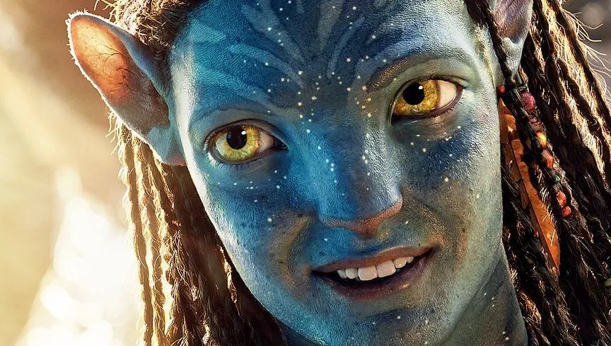

# Sujet 1 - Avatar IA

## Objectifs
- Créer un avatar permettant d'interagir avec un humain
  - Prise en compte du positionnement des mains / yeux de l'interlocuteur
  - Intercation vocale en langage naturel
  - Connaissance détaillée de CPE Lyon (formations, asso BDE, ...)
  - Mise en place d'un AVATAR (idéallement en 3D )
  - Optionnel : Prise en compte des émotions de l'humain
  - Optionnel : Intégration Home Assistant permettant de gérer des équipements de la salle
  - Optionnel : Remplacer avatar par robot Baxter

## Contraintes
- Fonctionnement 100% local sur un i7 / 16Go Ram / RTX2070 super 4Go (et éventuellement un calculateur IA GX-10 ASUS NVIDIA)
- Maquette soignée
- Impression 3D obligatoire + ESP32 obligatoire (ajout capteur ou actionneur, e.g. capteur de présence, sourcils qui bougent, ...)

## Technologies
- LLM
- Deeplearning
- Interaction Homme-Robot (...Deepface, Mediapipe, Openpose, Whisper ...)
- Impression 3D obligatoire
- ESP32
- Pour l'Avatar; par exemple , Pygame,  Ogre3D, Panda3D, Unity 

