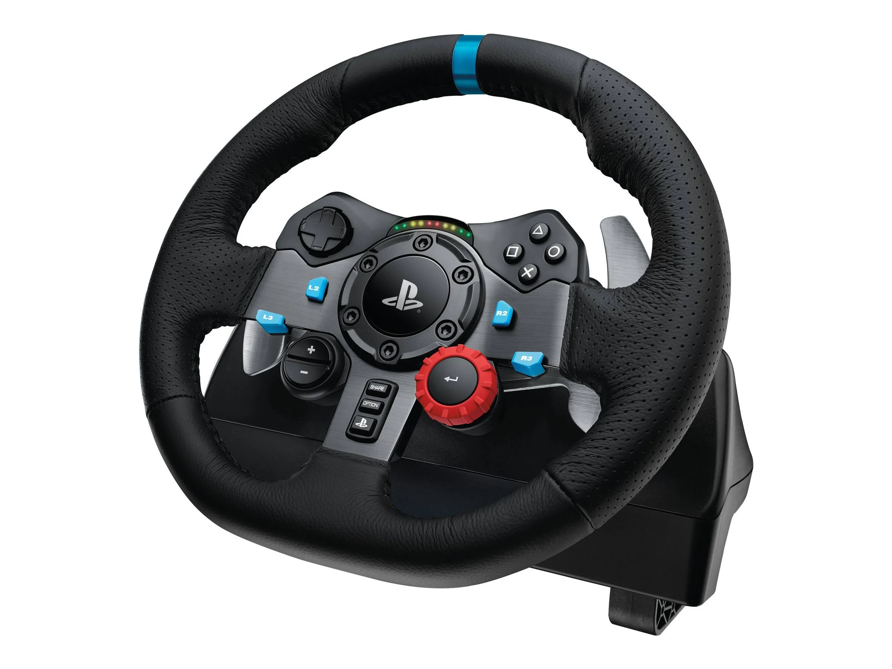

# Sujet 2 - Scénario libre avec le LIMO

  <video class="videoembed" autoplay muted loop playsinline>
    <source src="img/Limo.mp4" type="video/mp4">

    Your browser does not support the video tag.
  </video>

## Objectifs
- Usage de 1 ou plusieurs robots (multirobots) LIMO pour un scénario robotique à définir. 
- Scénario fonctionnel en simu ET en réel
- "Augmenter" les robots avec une impression 3D et un capteur ou actionneur ajouté avec un ESP32 
- Demo adhoc avec tous les types de roues

## Contraintes
- Usage embarqué de ROS2 jazzy
- Navigation autonome
- Feature Navigation manuelle (avec volant / pédales)
- Impression 3D obligatoire
- ESP32 obligatoire (ajout capteur ou actionneur)

## Technologies
- ROS2
- Python / C++
- Lidar / Caméra 3D 
- Jetson

## Ressources

- [Doc du LIMO en ROS2](https://github.com/agilexrobotics/limo_ros2_doc/blob/master/LIMO-ROS2-humble(EN).md)  

- [Repo ROS2 du LIMO](https://github.com/agilexrobotics/limo_ros2)

